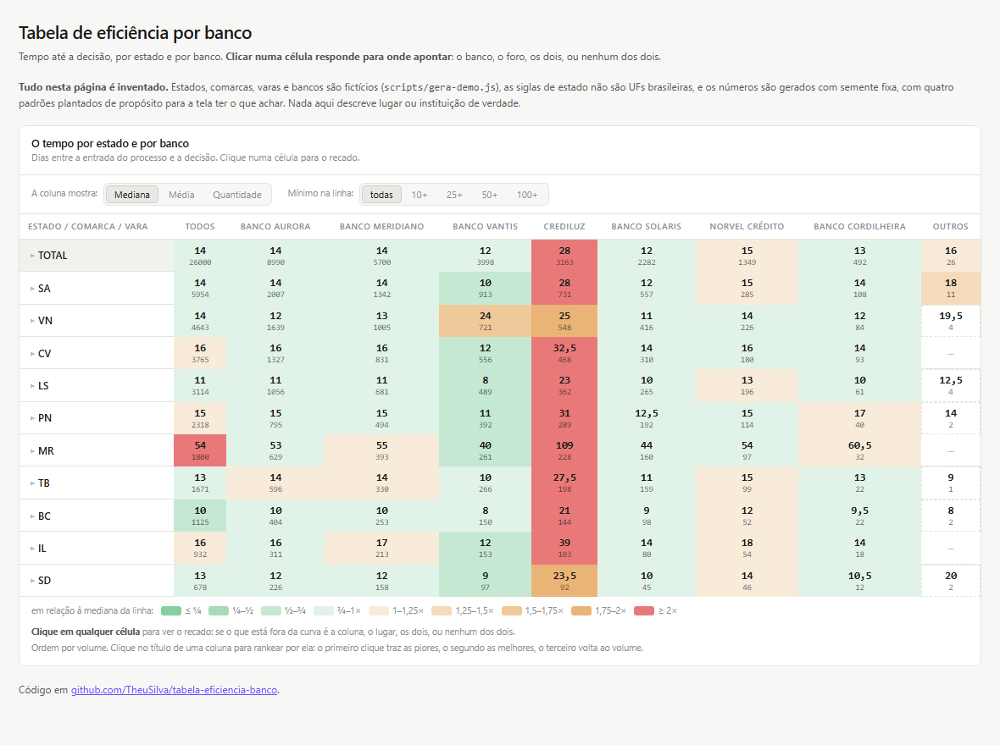
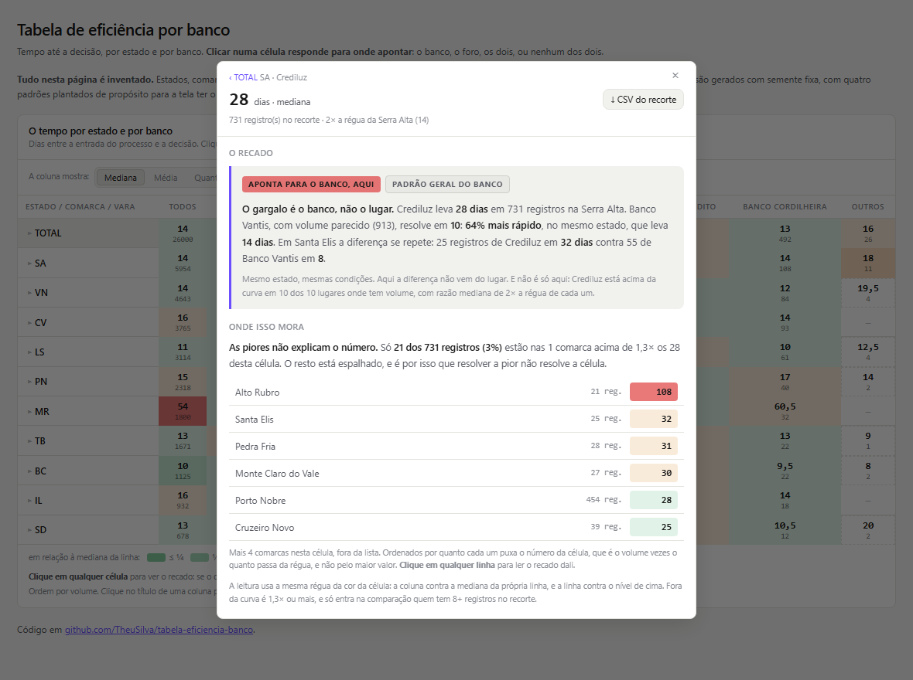

# tabela-eficiencia-banco

Uma tabela de **lugar × banco** em que clicar numa célula responde, em uma frase,
**para onde apontar**: o banco, o foro, os dois, ou nenhum dos dois.

Mapa de calor todo mundo já viu. O problema é o que vem depois: a pessoa olha a célula
vermelha e pergunta *"e daí?"*. Uma tabela de apoio não responde isso, porque devolve mais
números para a mesma pergunta. Aqui a resposta é uma leitura escrita, calculada a partir da
mesma régua que pinta a célula, e a repartição do valor pelos níveis de baixo, para dizer se
o atraso está concentrado em poucas comarcas ou espalhado por todas.

Nasceu de um painel de acompanhamento processual, mas não tem nada de jurídico no código: a
hierarquia, o nome da coluna e a unidade vêm de `config.json`. Serve para qualquer medida em
que **menor é melhor** e a pergunta seja *"a culpa é de quem opera ou de onde opera?"*.

**Demonstração:** https://theusilva.github.io/tabela-eficiencia-banco/





## Os dados da demonstração são inventados

Estados, comarcas, varas e bancos são fictícios, gerados por `scripts/gera-demo.js`. As
siglas de estado (SA, VN, CV...) foram escolhidas por **não** serem UFs brasileiras, e os
nomes de banco não correspondem a instituição nenhuma. O CSV é gerado com semente fixa e vai
commitado: **a demonstração não precisa ser atualizada, nunca**, e o diff do git não muda
sozinho a cada execução.

Quatro padrões estão plantados de propósito, para a tela ter o que achar:

| padrão | onde | o que a tela deve dizer |
|---|---|---|
| foro lento para todos | Monte Rubro (MR) | aponta para o estado, e não para o banco |
| banco lento em toda parte | Crediluz | aponta para o banco, com a tarja de padrão geral |
| banco lento em um estado só | Banco Vantis no Vale do Norte | aponta para o banco, com o selo "mas é só aqui" |
| atraso concentrado numa comarca | Alto Rubro, dentro de Serra Alta | a cascata diz "atacar essa comarca muda o número" |

## O que ele responde

Clicando numa célula, sai uma de cinco leituras, sempre com o número ao lado:

| tarja | quando sai |
|---|---|
| **Aponta para o banco, aqui** | a coluna passa de 1,3× a régua da própria linha |
| **Aponta para o estado** | a linha passa de 1,3× o nível de cima |
| **Aponta para os dois** | as duas coisas ao mesmo tempo |
| **Nada fora da curva** | nenhuma das duas, e a frase diz que não há o que cobrar |
| **Padrão geral do banco** | entra junto, quando o banco repete o desvio na maior parte dos lugares |

Abaixo do recado vem **Onde isso mora**: os níveis de baixo ordenados por quanto cada um
puxa o número daquela célula, e uma frase que separa dois casos muito diferentes:
*"o atraso está concentrado, atacar essas duas comarcas muda o número"* de
*"as piores não explicam o número, o resto está espalhado"*. Cada linha da lista é clicável
e abre o mesmo recado um nível abaixo.

No topo do quadro, embaixo do ×, o botão **CSV do recorte** baixa só os registros daquela
célula: o lugar da linha e o banco da coluna (na coluna *Todos*, o lugar inteiro). O arquivo
sai do mais demorado para o mais rápido, no mesmo formato de entrada, então dá para abrir no
Excel ou devolver para a tabela, e a quantidade de linhas é sempre a que a célula mostra.

## As decisões que fazem a frase valer

Estão aqui porque cada uma nasceu de uma leitura errada que a versão anterior produzia.

**A régua é relativa, nunca uma tabela fixa de valores.** A cor e a frase saem da razão
contra a referência da própria linha, e a linha se compara com o nível de cima. Uma tabela
fixa ("acima de 30 dias é vermelho") responde outra pergunta e apaga o contraste justamente
onde o lugar inteiro é lento.

**Quem compara é o de volume parecido, não o maior.** Comparar um banco de 42 processos com
outro de 2.400 convida à resposta pronta ("eles têm escala") e a conversa morre ali. O código
escolhe, entre os mais rápidos, o de volume mais próximo, e a expressão "com volume parecido"
só sai quando a diferença é de até 2×. Acima disso a frase escreve o número seco.

**A prova vem do nível de baixo e só confirma.** Deixar uma comarca disparar o veredito acusa
o banco errado assim que aparece um lugar pequeno com contraste grande. A razão decide, a
comarca ilustra.

**O padrão geral não é a mediana do banco.** Carteira concentrada num estado lento pareceria
lenta sem ser. O que vale é a mediana das razões contra cada lugar.

**A cascata conta processos, nunca recalcula mediana.** A pergunta natural é "quanto cairia
sem as piores", e ela exige os registros, não as medianas: média de medianas não é mediana.
Por isso a tela afirma quantos registros caem em foro acima da régua, que é honesto com o
que a tabela guarda. Há um teste só para isso.

**Célula abaixo do mínimo não recebe cor, não disputa ranking e não vira culpada.** Sem essa
regra a comarca de um processo só vira a "melhor do país" no primeiro clique de ordenação.

**Português tem gênero, e frase montada com concatenação quebra.** O vocabulário em
`config.json` carrega as formas prontas, então trocar "banco" por "carteira" não produz
"o carteira" nem "todos as carteiras". Dois testes cobram isso, um em cada gênero.

## Uso

```bash
node scripts/gera-demo.js            # dados fictícios em dados/exemplo.csv
node teste/testa.js                  # 55 verificações, sem navegador
node scripts/gera-pagina.js          # monta docs/ (é o que o GitHub Pages serve)
```

Com dados próprios, o CSV precisa destas colunas (separador `;` ou `,`):

```
NIVEL1;NIVEL2;NIVEL3;CATEGORIA;VALOR
SA;Porto Nobre;Vara 3;Banco Aurora;12
```

`NIVEL2` e `NIVEL3` são opcionais: com um nível só, a tabela não tem hierarquia e a cascata
não aparece. `VALOR` é qualquer medida em que menor é melhor (dias, horas, custo).

Na página:

```html
<script src="logica.js"></script>
<script type="text/babel" src="matriz.jsx"></script>
<script type="text/babel">
  ReactDOM.createRoot(alvo).render(<Matriz m={matriz} voc={voc} titulo="..." />);
</script>
```

Para o quadro ganhar o botão de download, passe também `registros`: o array que montou a
matriz, ou uma função que o devolva (ou prometa). A função é para a página só buscar a base
quando alguém pedir o recorte, que é como a demo faz:

```jsx
<Matriz m={matriz} voc={voc}
  registros={() => fetch('exemplo.csv').then((r) => r.text()).then(MG.leCsv)} />
```

Não há build: o React vem por CDN e o Babel transpila no navegador, que é o mesmo caminho da
demo. `src/logica.js` roda igual no Node (`require`) e no navegador (`window.MG`), e é ele
que a suíte de testes exercita.

## Ajuste (`config.json`)

- `matriz.minN`: mínimo de registros para um nível virar linha e para uma célula receber cor.
- `matriz.minCol` e `matriz.topCols`: quem ganha coluna própria. O resto vai para *Outros*,
  que leva o nome da categoria quando sobra apenas uma.
- `voc`: as palavras e a concordância. `niveis` nomeia a hierarquia (estado, comarca, vara),
  `categoria` e `catFem` nomeiam a coluna, `unidade` é o que aparece depois do número, e
  `nomes` mapeia rótulo para nome próprio com preposição, como `{"SA": ["Serra Alta", "da"]}`,
  que é o que faz a frase dizer "a lentidão é da Serra Alta" em vez de "de SA".

## Estrutura

```
src/logica.js       régua, montagem da tabela, recado e cascata (sem DOM)
src/matriz.jsx      o componente React
src/estilo.css      tokens e layout, tema claro e escuro pelo ajuste do sistema
scripts/gera-demo.js    dados fictícios determinísticos
scripts/gera-pagina.js  monta docs/ para o GitHub Pages
teste/testa.js      55 verificações, sem navegador
```

## Licença

MIT. Ver [LICENSE](LICENSE).
